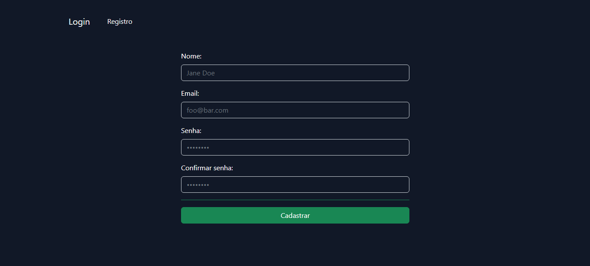
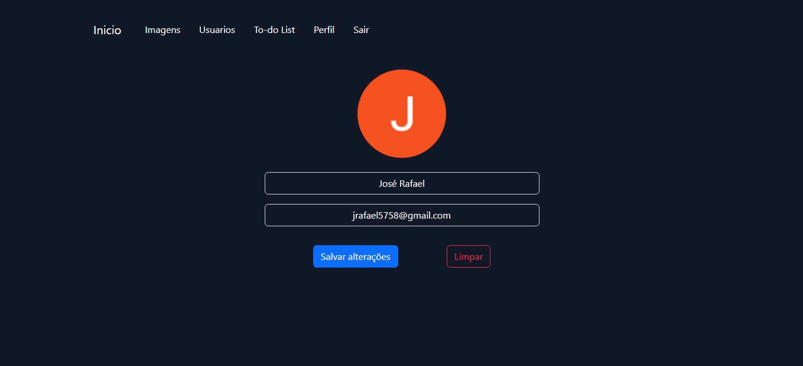
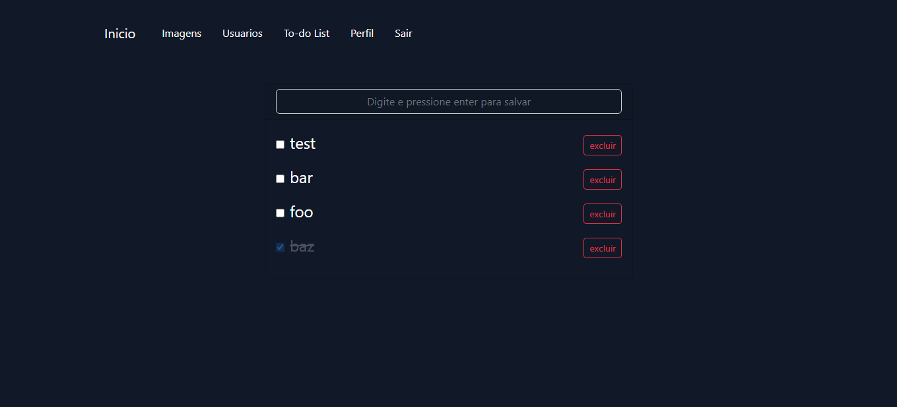
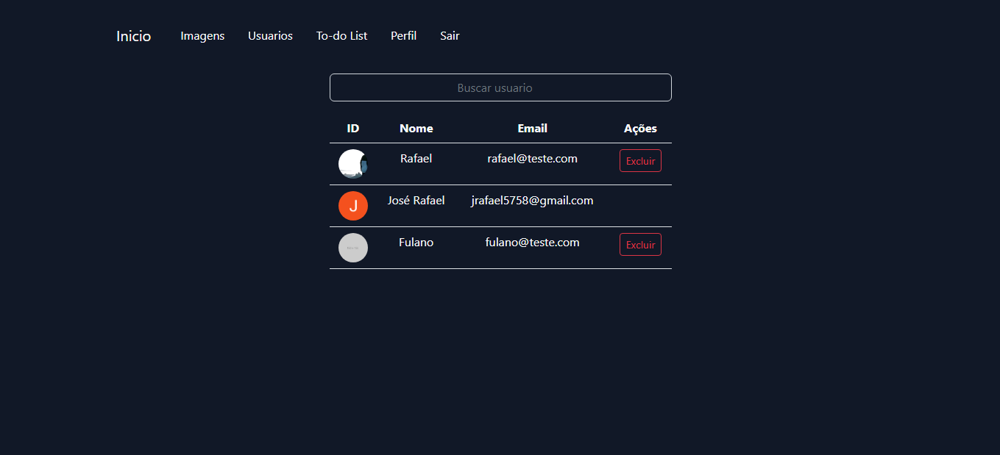
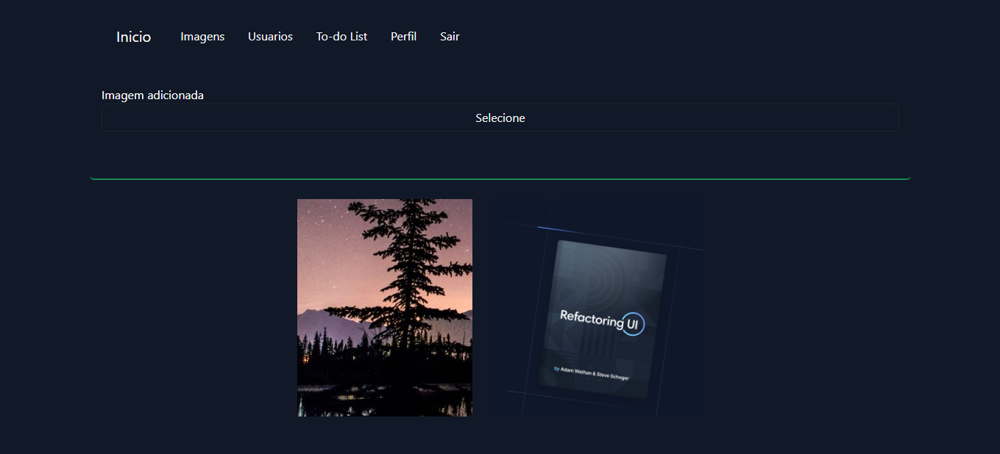

<h2> Login </h2>

    Seção de login, com a possibiidade de autenticação social, usando as credenciais do Google / Github.
    
<h2> Registro </h2>

    Seção de registro.

<h2> Perfil </h2>

    Seção de perfil, onde é possivel alterar email, nome e foto de avatar.
    
<h2> To-do </h2>

    Seção de to-do, onde é possivel gerenciar uma lista da afazeres.
   
<h2> Usuários </h2>

    Seção de usuarios, onde é possivel gerenciar os usuarios cadastrados.
    
<h2> Imagens </h2>

    Seção de imagens, onde é possivel fazer o upload de imagens.
